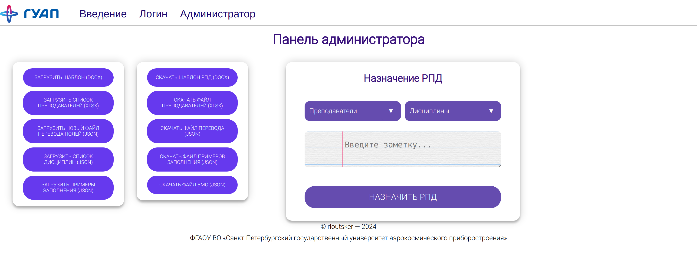
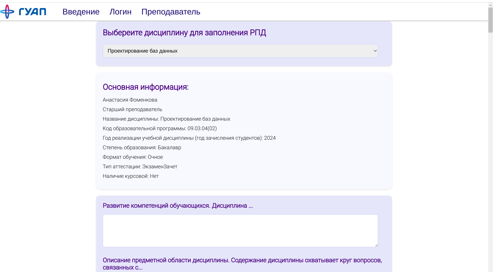
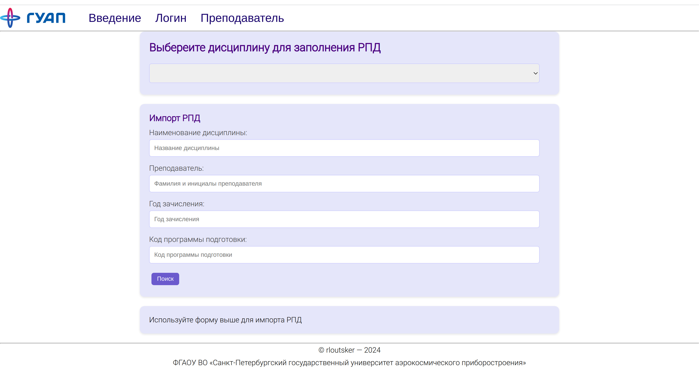
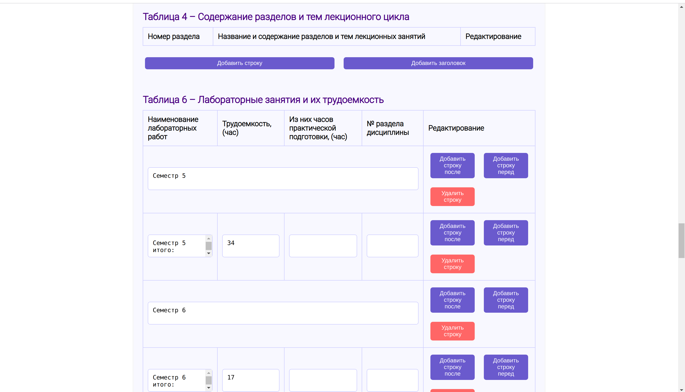

# RPD Drafter Application
## Overview
Application that facilitates the setup and management of guideline documents.
This application provides a server API for the creation and editing of documents
based on predefined templates with role-based access control. Administrators can
configure and modify the templates, while teachers can create and fill out
documents based on these templates.

## Features
- Role-Based Access Control: admins can manage templates,
  and teachers can create and import documents.
- RPD Management: creation, editing, import and assignment
  of the guidelines documents.

## Tech stack
- Backend: Java Spring stack
- Frontend: TS Angular
- Database: PostgreSQL for user credentials and documents data.
- Document Handling: Apache POI for managing .docx files.
- Containerization: Docker and Docker Compose

## Configuration Documents
The application operates with several configuration files:
- `rpd-template.docx`: a docx file containing a pre-prepared template
  for the course outlines, conforming to the university's standards.
- `teacher-data.xlsx`: an xlsx file listing the teachers who will be
  using the application.
- `umodto.json`: a json file with data on courses from the curriculum
  and the educational department's database.
- `translations.json`: a json file containing translation information
  for field names in the umodto.json file and variables in the course outline template.
- `samples.json`: a json file with examples for filling out sections of the template.

## Appearance
### Admin Panel

### Teacher Import

### Teacher RPD Essentials

### Teacher RPD Tables

